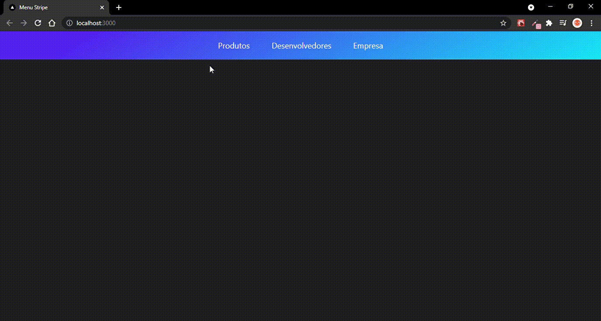

<div align="center">
  <h1>Menu Dropdown Stripe 💹</h1>
</div>
<hr/>

<h2 align="center" >Header do <a href="https://stripe.com/en-br">Stripe 💸</a></h2>
<h3 align="center">A cada dia fico mais fascinado por animações 💜</h3>
<hr />

<h4 align="center">➡️<a target="_blank" href=""> Breve faço o deploy </a>⬅️</h4>
<hr/>

<div align="center">


</div>
<hr/>

<h2> 🎬 Tecnologias</h2>
 
<ul>
  <li><a target="_blank" href="https://reactjs.org/" >React</a> - Código base do projeto.</li>
  <li><a target="_blank" href="https://styled-components.com/" >Styled-components</a> - Masterizar a componetização e estilização no projeto</li>
  <li><a href="https://www.framer.com/motion/">Framer Motion</a> - para realizar a animação do menu</li>
</ul>
<hr/>

<h2> 🛠 Features</h2>

<p>Alguns dos recursos dessa aplicação:</p>

-   [ ] Altura e largura de cada item flexíveis e animadas;
-   [ ] Animação suave e contínua entre os conteúdos de cada item do menu;

<h4> 🚨Em construção 🚨</h4>

-   [ ] Refatorar código..;

<h2> 📬 Visão geral do projeto</h2>

<div align="center">
  
</div>

<hr/>
<h3 align="center"> Inspirado em um vídeo da <a href="https://rocketseat.com.br/">Rocketseat</a> 💜💜 </h3>
<hr/>

<h2> 📬 Pré requisitos</h2>

Ferramentas necessárias para rodar o projeto na sua máquina:
[Git](https://git-scm.com) e [Node.js](https://nodejs.org/en/). 
Além disto é bom ter um editor para trabalhar com o código como [VSCode](https://code.visualstudio.com/)

<h3> 🚩 Rodando o projeto:</h3>

```bash
# Clone este repositório
$ git clone https://github.com/Igor-Mont/TestApiPoke

# Acesse a pasta do projeto no terminal/cmd
$ cd TestApiPoke

# Instale as dependências usando npm ou yarn
$ npm install
$ yarn

# Execute a aplicação em modo de desenvolvimento
$ npm start
$ yarn start

# O servidor inciará na porta:3000 - acesse http://localhost:3000
```

<!-- <h3>Deploy feito na <a href="https://vercel.com/new?utm_source=github&utm_medium=readme&utm_campaign=next-example">Vercel</a> 🖤</h3> -->
